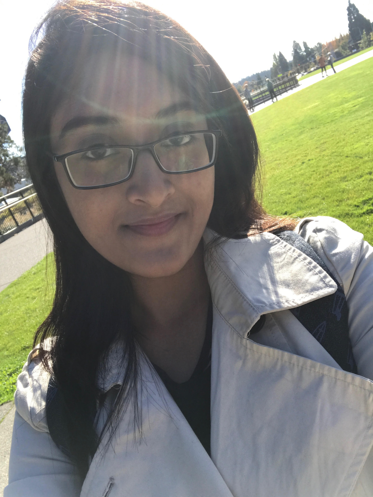
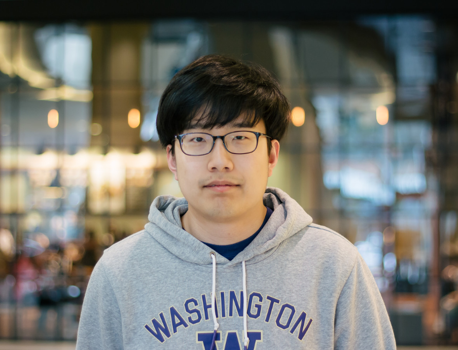
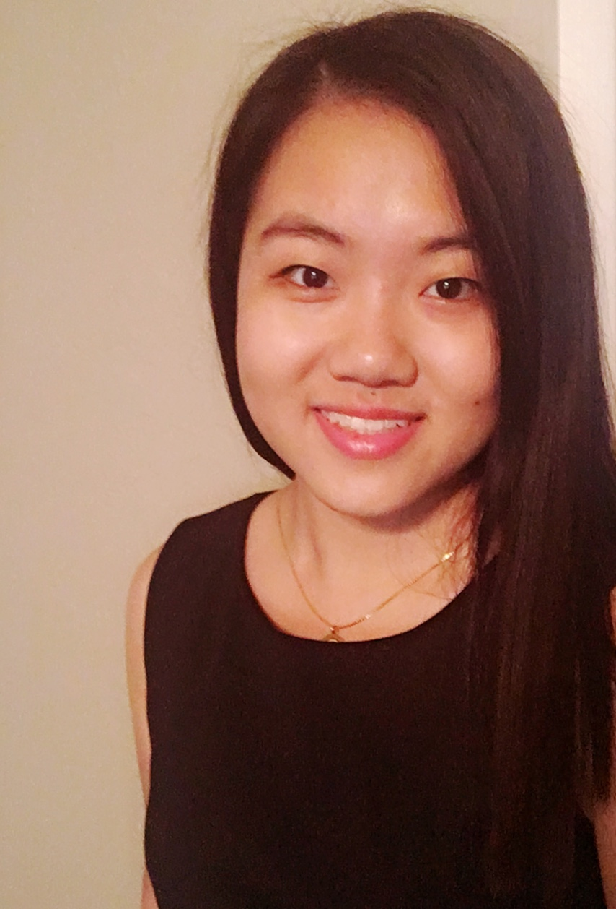

```{r setup, include=FALSE}
knitr::opts_chunk$set(echo = TRUE)
```


#### This App is created for the INFO 201 course in Winter 2019 by a group of four UW students:

#### **Jong Tai Kim, Raida Karim, Jeff Tu, and Po Hou.**


#### Read more about our group and project [here.](https://github.com/warandstar/af4_finalproject/blob/master/README.md)


### This is us:

{width=150px}

{width=200px}

{width=150px}
